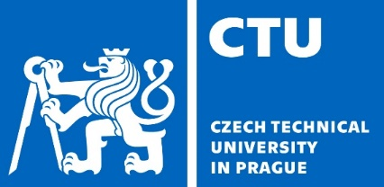
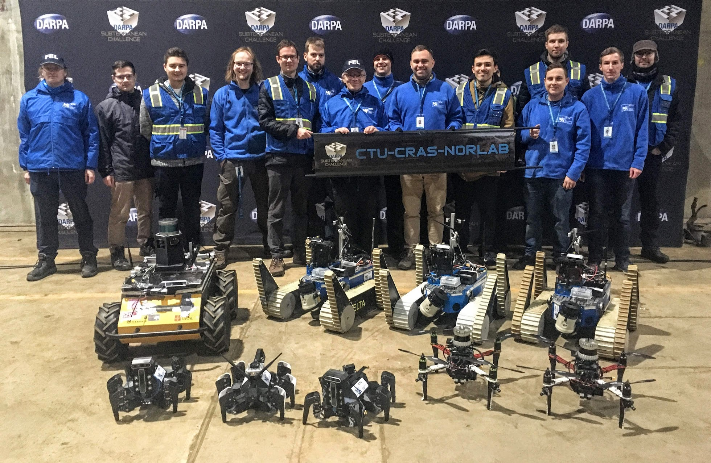

# ros-utils

Various ROS utilities and building blocks developed by [Center for Robotics and Autonomous Systems (CRAS)](https://robotics.fel.cvut.cz/cras/) at [Faculty of Electrical Engineering](https://fel.cvut.cz/) of [Czech Technical University in Prague](https://www.cvut.cz).

Parts of this package were used by [team CTU-CRAS-Norlab in DARPA Subterranean Challenge](https://robotics.fel.cvut.cz/cras/darpa-subt/).

* `cras_bag_tools`: utilities for working with BAG files, including filters and image extractor
* `cras_cpp_common`: convenience utilities for ROS programming in C++
* `cras_docs_common`: utilities for setting up documentation generators
* `cras_py_common`: convenience utilities for ROS programming in Python
* `cras_topic_tools`: nodes and nodeletes for safe and efficient manipulation with topics
* `image_transport_codecs`: image\_transport converted to C++ and Python libraries directly usable even without a running ROS system

## Support and Build Status

This package is supported on Melodic and Noetic until their End of Life (and maybe later). It is occasionally tested with non-default GCC versions like Melodic+GCC8 or Noetic+GCC11.

Development versions:

Releases:

